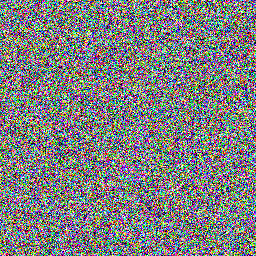

# DDPM/DDIM 复现（Jittor及Pytorch）

本项目尝试使用 Jittor 和 Pytorch 复现 `DDPM/DDIM` ，并对比在 `CIFAR-10` 数据集下

1. Jittor 和 Pytorch 下 UNet 的训练速度；
2. Jittor 和 Pytorch 下 DDPM/DDIM 的推理速度；
3. DDIM 在不同 num_steps 下的表现（FID）；

# 一、项目搭建

## 环境配置

### Jittor 环境
```bash
device:
RTX 3090(24GB)*1
14 vCPU Intel(R) Xeon(R) Gold 6330 CPU @ 2.00GHz

env:
ubuntu22.04 
cuda11.8 
python3.10.16-dev
libomp-dev
gcc11.3.0 with libstdc++.so.6-GLIBC_3.4.30
nvcc11.8

pkgs:
jittor=1.3.9
matplotlib=3.10.0
numpy=1.26.4
pillow=11.2.1
tqdm=4.67.1
```

### Pytorch 环境
```bash
device:
RTX 3090(24GB)*1
14 vCPU Intel(R) Xeon(R) Gold 6330 CPU @ 2.00GHz

env:
ubuntu22.04
cuda11.8
python3.10.16

pkgs:
pytorch=2.5.1
pytorch-cuda=11.8
matplotlib=3.10.0
numpy=2.0.1
pillow=11.0.1
tqdm=4.67.1
```

## 项目结构

 `Jittor-ver` 和 `Pytorch-ver` 结构均如下：
```bash
.
├── checkpoints         # 检查点（保存已训练模型参数）
├── core                # 核心代码
│   ├── __init__.py
│   ├── diffusion.py    # 物理模型，定义加噪/去噪过程，包含DDPM过程和DDIM过程
│   ├── load_data.py    # 加载数据集
│   └── unet.py         # 定义UNet网络结构
├── func                # 辅助函数
│   ├── __init__.py
│   └── logger.py       # 日志器
├── logs                # 日志文件
├── samples             # 采样结果
├── requirement.txt     # 依赖库
└── script              # 训练/测试脚本
    ├── __init__.py
    ├── model.py        # 封装训练/采样/日志等功能
    ├── sample.py       # 采样脚本
    └── train.py        # 训练脚本
```

## 脚本

### train.py (数据加载脚本封装在其参数中)

```bash
训练脚本:
    训练新的模型，或加载预训练模型继续训练。
    选项可以指定部分参数，完整参数可以通过json文件指定。
    所有选项均有默认参数，可以直接运行脚本，会以当前时间戳从以默认配置训练一个新模型。
命令行：
    python -m script.train [--<option>=<value>]
选项:
    --model_path: 预训练模型路径（可加载预训练模型继续训练）
    --config_path: 配置文件路径（可以直接指定配置文件，优先级低于命令行参数）
    --data_root: 数据集根目录（默认为../../data/）
    --dataset_name: 数据集名称（默认为cifar10）
    --num_epochs: 训练轮数（默认为500）
    --batch_size: 批大小（默认为128）
    --num_workers: 线程数（默认为4）
    --T: 时间步数（默认为1000）
    --lr: 学习率（默认为1e-4）
    --device: 设备类型（优先为cuda）
    --log: 是否记录日志（默认为True）
    --log_root: 日志根目录（默认为logs/）
    --checkpoint: 检查点间隔，epoch到检查点后备份一次模型（默认为5）
    --only_checkpoint_max: 只保留最新的检查点（默认为True）
其他：
    命令行仅可指定部分参数，完整参数可以通过json文件指定，在script.model.default_config可以
    查看默认配置。配置文件中可以指定分辨率层数，各层通道数，自注意力块分布等网络结构参数。
```

### sample.py （测试脚本封装在其参数中）

```bash
采样脚本：
    加载预训练模型，随机采样噪声，生成图像。
    一般会使用--model和--config来指定模型和模型配置，--step指定使用DDIM采样器。
命令行:
    python -m script.sample [--test] [--<option>=<value>]
选项：
    --model_path: 模型路径（默认为当前目录）
    --config_path: 配置文件路径（默认为当前目录）
    --show_denoised: 展示降噪过程（默认展示16张）
    --batch_size: 批大小（默认为64）
    --gif_time: gif总时间，单位ms（默认8000ms）
    --sample_root: 采样结果保存路径（默认为samples/）
    --num_workers: 线程数（默认为4）
    --device: 设备（优先为cuda）
    --log: 是否记录日志（默认为True）
    --log_root: 日志保存路径（默认为logs/）
    --steps: 指定采样步数，不指定时使用DDPM，指定时使用DDIM
    --test: 开启测试模式，采样出npy文件
```

# 二、训练过程对比

## 训练参数/结构

使用 `CIFAR-10` 数据集，原论文使用的是 `分辨率(32, 16, 8, 4)` `自注意力块(False, True, False, False)` 。对于原论文在更低分辨率下取消了自注意力块，作者猜测可能是对于过拟合的考虑，由于作者没有训练 `800k steps` （原论文达到 STOA 时的 steps ）的打算，使用了 `分辨率(32, 16, 8, 4)` `自注意力块(False, True, True, False)` 想要在 `40k steps` 内尽可能提高采样效果。

`ddpm/ddim 物理过程`

<div align="center">
    
</div>

这是物理概率模型：

-  `p_sample` 为加噪采样，可以由 $x_0$ 一步采样得到任意 $x_k$ 的加噪图片。
- `q_sample (DDPM)` 为去噪采样，可以由 $x_t$ 采样得到 $x_{t-1}$ 的去噪图片。
- `q_sample (DDIM)` 为去噪采样，可以由 $x_t$ 采样得到 $x_{t-k}$ 的去噪图片，但是跳步会降低采样质量。

`UNet: eps model of ddpm/ddim （画的有些大了，可以下载下来放大看）`

<div align="center">
    
</div>

这是 `eps_model` ，一个预测随机噪声 $\epsilon$ 的噪声预测器，采用 `UNet` 网络结构。

`UNet` : 使用 4 层分辨率 $(32, 16, 8, 4)$ ，各层注意力块使用情况为 $(False, True, True, False)$ 。分为 `Down` , `Mid`, `Up` 三个部分。

`Down`: 图像经过一次卷积提升通道数后。各层通过 ResAtnBlk(DownBlk) 提取特征，再通过 DownSample(Conv) 降低特征图分辨率以提取更高层特征。

`MidBlk`: 通过 ResBlk-AtnBlk-ResBlk 整合最高层的特征。

`Up`: 通过 ResAtnBlk(UpBlk) 提取特征，再通过 UpSample(TransConv) 升高特征图分辨率重构图像。 UpBlk 与 DownBlk 不同的是，需要使用 skip connection 恢复低层特征，观察 UNet 的 Down ，我们发现每层都有 3 个数据，所以我们在右层使用 3 个 UpBlk 与对应的数据进行融合以恢复低层特征，这就是 Up 相比 Down 每层要多一个块的原因。

`ResAtnBlk`: 残差自注意力块，先经过 ResBlk 提取特征再通过 AtnBlk(可选) 整合特征。

`ResBlk`: 残差块，经过经典 norm-act-conv 结构后，通过残差连接补充部分失去的特征，保证即使该块不能学习到有效的特征，也能通过 shortcut(x) 保证起码效果不会变差（原本信息还在）。简单来说就是不会让卷积核直接梯度消失了起反效果。另外，它嵌入了 TimeEmbedding 信息，维持时间步在变换中信息一直存在不会丢失。

`AtnBlk`: 注意力块（此处为自注意力块），捕捉特征图中的长距离关系，将 `ResBlk` 中捕捉到的局部特征整合为更全局的特征。比如将各种纹理特征总结为物体特征。

`TimeEmbedding`: 时间编码，作者使用的是正余弦位置编码结合 MLP ，前者的优点是它的函数周期性正好对应时间的相对性，编码的泛化能力好，后者的优点是编码出来的是可学习的非线性特征，适应性好。

`其他`: 作者本来打算嵌入文本提示的，但是由于复现 DDPM 时下意识跟着原论文做了没有文本提示版本的并完成了训练，后续没有时间精力成本继续加入文本提示（因为主要目标已经实现了，加入文本提示也不能增加很多内容，还得各种调参训练，还得扯上 CFG 等等加起来又是好几篇文章）。在此简单叙述一下：在 ResAtnBlk 中，可以在 SelfAtn 后添加一个 CrossAtn 交叉注意力，通过 text-prompt 为 key , image-feature 为 query , 整合特征从而引导 image-feature 往 text-prompt 方向靠拢。为什么 time-step 用 TimeEmbedding 直接编码嵌入而 text-prompt 却要用 CrossAtn 呢？作者有这些方面的观点：

- time-step 是一个标量，可以简单地编码融合进图像，而 text-prompt 是 tokens ，无法被简单地编码；
- time-step 本身就是带噪图像本身的属性， ResBlk + SelfAtn 直接融合整理自身属性无可厚非（和 shortcut 也许有差不多的意思），而 text-prompt 是外部的动态提示；
- text-prompt 的 tokens 具有复杂语义和全局关系，通过 CrossAtn 的优势可以充分引导全局语义特征向 text-prompt 方向靠拢，还能动态加权特征引导信息。

## loss 分析

`eps model loss of one epoch (epoch = 1 and epoch = 80)`

<div align="center">
    
    
</div>

`eps model loss`

<div align="center">
    
</div>

可以看到， Jittor 与 Pytorch 的 `loss 曲线` 几乎吻合，这在完全相同的 model 下是可以预见的，框架的不同对结果的影响是微乎其微的。前段 warmup 过程中的的略微差异，是随机性导致的结果，在前段的 `300 steps of epoch 1` 下可以看到随着步数增加， loss 随着统计量的增大逐渐趋于相同态势。

最终 `loss` 全部趋于 `0.030` 左右。

## 训练时间对比

`time per step (epoch = 1 and epoch = 80)`

<div align="center">
    
    
</div>

`time per epoch`

<div align="center">
    
</div>

训练时间上， Jittor 的训练速度明显要慢于 Pytorch，并且不稳定。前期速度非常慢，猜测是正在进行计算图优化，后期相对前期稳定在了一个较快的速度，但依旧慢于 Pytorch 。关于速度低于 Pytorch 的更多的原因，我在下面的 `GPU利用率` 部分进行了分析。

```
Jittor average time: 142.4263265306123s
PyTorch average time: 139.2600934579439s
```

## 关于 Jittor 和 Pytoch 的 GPU

`Jittor（前）和 Pytorch（后） 的 GPU 占用率曲线`

<div align="center">
    
    
</div>

可以看到 Jittor 的 GPU 占用率与 Pytorch 相比：

- Jittor 在单个 epoch 内出现了很多波谷， Pytorch 几乎稳定在 100% ；
- Jittor 在 epoch 间有较大的空窗期， Pytorch 几乎没有甚至完全没有；

因此 Jittor 的 GPU 利用率显著低于 Pytorch ，在尝试多种调整和优化无果后，推断可能是如下原因：

- Jittor 的 Dataloader 不支持 `persistent_workers` （workers长期驻留不释放） 导致 Jittor 经常陷入数据传输的瓶颈，作者认为这是最有可能的原因；

- （ jt.DataLoader 也没有 `pin_memory` （加速 CPU 到 GPU 的数据传输），但可能是因为 Jittor 的统一内存管理机制天然支持固定内存，不存在显示指定）

- Jittor 的动态编译计算产生一个等待期，导致的 GPU 利用不稳定；

以上均属于猜测，也可能由于一些如算子实现等方面的原因，如 Jittor 中没有 `einsum()` ，因此需要手动进行矩阵转置并进行 `matmul()` 可能效率不如 `Pytorch` 的内置实现；

# 三、推理过程对比

使用 `CIFAR-10` 数据集，取 `40k steps` 下最低 `loss` 的已训练模型作为噪声预测器。如下展示了 Pytorch 和 Jittor 下的随机采样。

`去噪过程 GIF (Pytorch) `

<div align="center">
    
    
</div>
    
`去噪过程 PNG (Pytorch)`

<div align="center">
    
    
    
    
    
    
    
    
    
    
    
    
    
    
    
    
</div>

`去噪过程 GIF (Jittor) `

<div align="center">
    
    
</div>

`去噪过程 PNG (Jittor)`

<div align="center">
    
    
    
    
    
    
    
    
    
    
    
    
    
    
    
    
</div>

### DDIM在各steps下的推理时间 / DDPM的推理时间 per batch128

| 框架    | 50 steps | 250 steps | 1000 steps | DDPM |
| ------- | -------- | ---------- | --------| ------- |
| PyTorch | 5.48s  |   27.86s   |  111.81s  |  111.75s  |
| Jittor  |  4.64s |  27.55s  | 107.32s | 101.85s |

可以看到：

- 使用 DDIM 的跳步后，速度线性降低；
- 1000 steps 的 DDIM 和 DDPM 速度一致（DDPM略微快一些的原因可能在于DDIM中处理了噪声权重）；
- Jittor 的采样速度比 Pytorch 快，由于采样时无需加载数据，进一步确认 Jittor 训练瓶颈在于数据加载。

`Jittor 采样时的 GPU 利用率`

<div align="center">
    
</div>

可以看到采样过程由于没有的数据加载的瓶颈（作者推断）， Jittor 采样速度超过了 Pytorch 。

# 四、推理结果对比

`以下均为 40k steps 下的 FID 2048 features` （比论文中的 `800k steps` FID 差的有点远 QAQ）

| 框架    | 50 steps | 250 steps | 1000 steps | DDPM |
| ------- | -------- | ---------- | --------| ------- |
| PyTorch | 76.4280 |   69.9747   |  67.6593  |  70.1668  |
| Jittor  |  80.1767 |  72.9338  | 71.8128 | 74.2720 |

可以看到：

- 使用 DDIM 的跳步后，生成质量降低（FID增大）；
- DDPM 相比 `1000 steps DDIM` 质量有些降低，猜测可能是作者在 DDPM 物理模型中使用了超参数 $\beta$ 直接近似噪声方差，而在 DDIM 中精确计算了；（预期结果为效果等效）
- Jittor 的生成质量低于 Pytorch ，这是概率性的原因，作者在 `40k steps` 的训练下取了最低 loss 已训练模型，但实际上 Jittor 的最低 loss 出现在 78 epoch 而 Pytorch 出现在 103 epoch ；（加上作者并未多次实验，并且实验量采用了小批次-1000张图片）

# 五、参考文献/仓库

> Denoising Diffusion Probabilistic Models [论文地址](https://arxiv.org/abs/2006.11239) [仓库地址](https://github.com/hojonathanho/diffusion)

> Denoising Diffusion Implicit Models [论文地址](https://arxiv.org/abs/2010.02502) [仓库地址](https://github.com/ermongroup/ddim)

> Jittor计图 [文档地址](https://cg.cs.tsinghua.edu.cn/jittor/assets/docs/index.html) [社区地址](https://discuss.jittor.org/)

> LabML [官网地址](https://nn.labml.ai/)

## More

Pylance类型检查检查不了Jittor！Jittor里面很多动态类型检查，建议关掉Pylance类型检查，不然查出一堆莫须有的错误傻傻的去各种搜索QAQ。